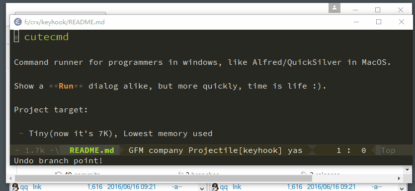

# cutecmd

Command runner for programmers in windows, like Alfred/QuickSilver in MacOS.

Show a **Run** dialog alike, but more quickly and **Script First**.

Project target:

 - **Script First**, run [AutoIt](https://www.autoitscript.com/site/autoit/) script first, then fallback to normal command

 - Launch App, or switch to it if opened ( see [shortcuts](shortcuts) )

 - Tiny(now it's 8K), Lowest memory used

## Install

1. Install [AutoIt](https://www.autoitscript.com/site/autoit/downloads/), using default options.

2. Copy **shortcuts** folder into any disk (D:), e.g.: `D:\shortcuts\`

3. Add `;D:\shortcuts\` to end of your **PATH** environment variable

Finished, ready to use, see below.

## Usage

Launch **cutecmd_x86.exe**(for 32bit windows) or **cutecmd_x64.exe**(for 64bit windows), **Windows 7+ need Administrator Privilege**.

**Double Click** your **Control Key** to show the input window.

Press file name matching in `shortcuts`, e.g.: `st` is Sublime Text

Press <kbd>Space</kbd> or <kbd>Enter</kbd> to confirm; Press <kbd>Ctrl+G</kbd> or <kbd>Esc</kbd> to cancel.

## Open.au3

Be carefule about the **Path** of each shortcuts, <kbd>Alt+Enter</kbd> to open and check the `open.au3` params.

**open.au3 parameters**

1. Execuable path

2. Window Matching method: **title** or **class**

3. Window Matching keywords

Example: `C:\WINDOWS\open.au3 "chrome.exe" title "Google Chrome"`

## Build

For `cutecmd`, using [TCC](http://bellard.org/tcc/) to build, keep it small.

Import the API definitions in `shell32.dll` as below:

    C:\tcc>tiny_impdef.exe c:\WINDOWS\system32\shell32.dll
    move shell32.def lib\

Complie:

    tcc cutecmd.c -lshell32

## Document translate

[zh-CN](docs/README-zh-CN.md)
*(more translations welcome!)*

